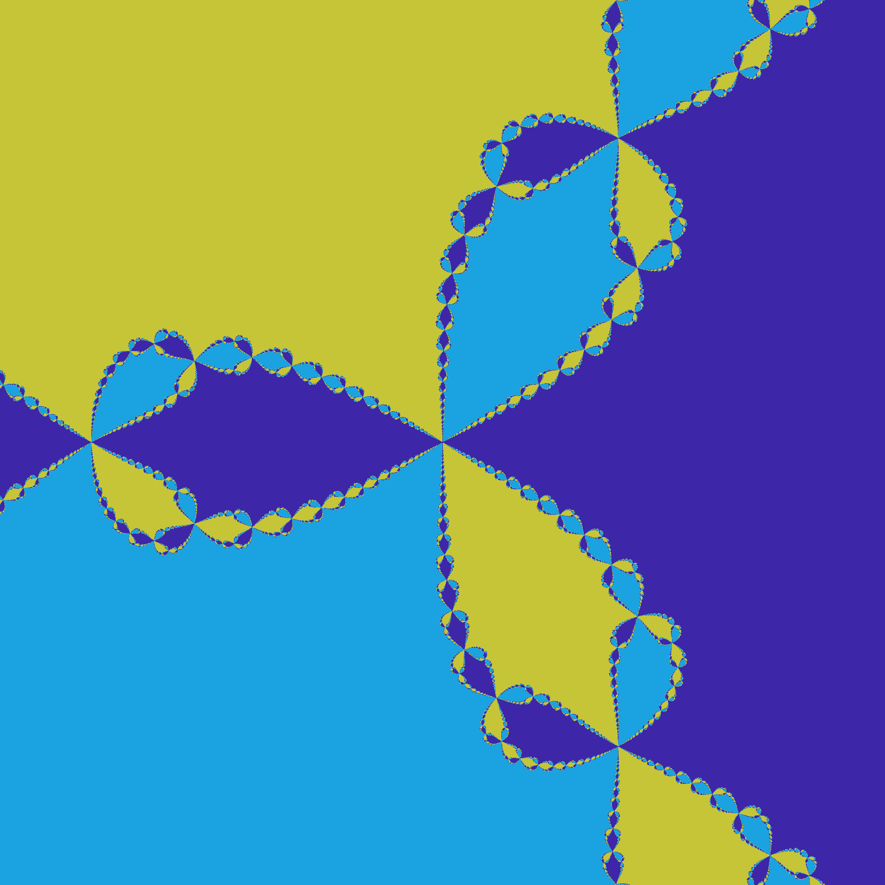
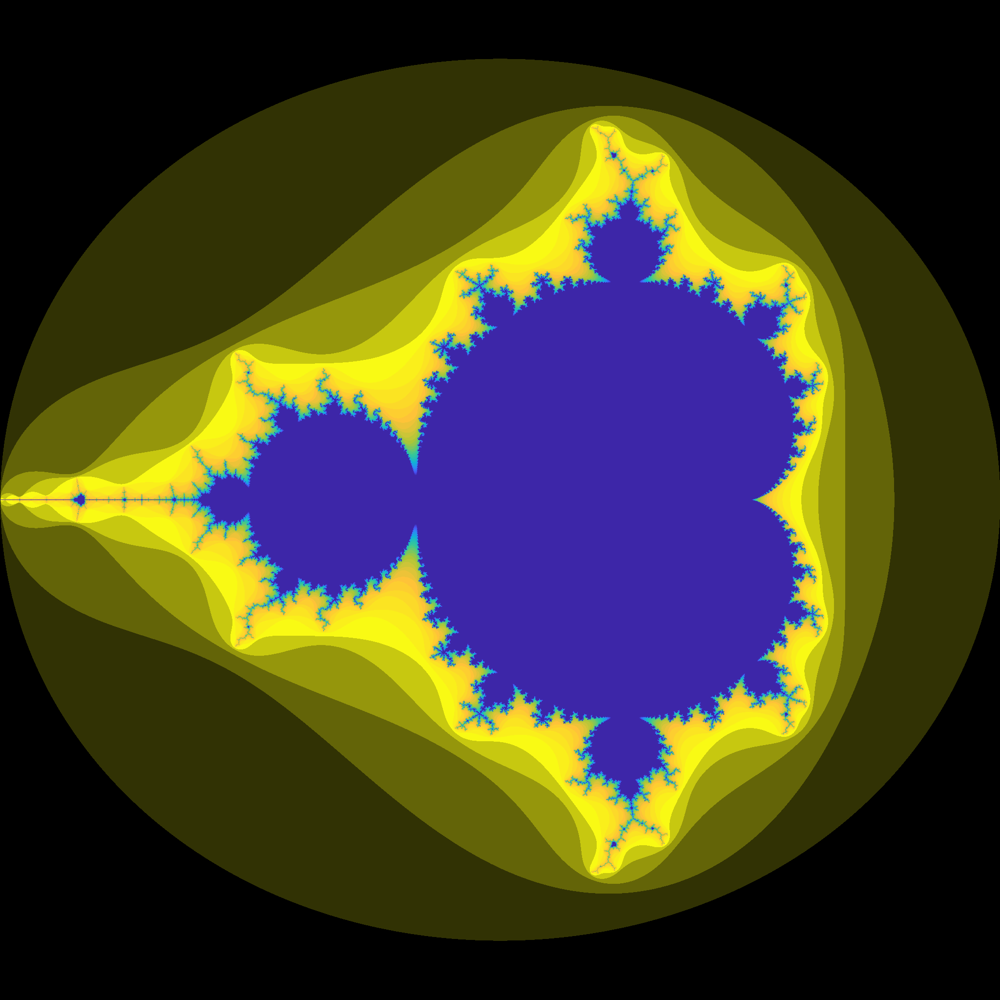
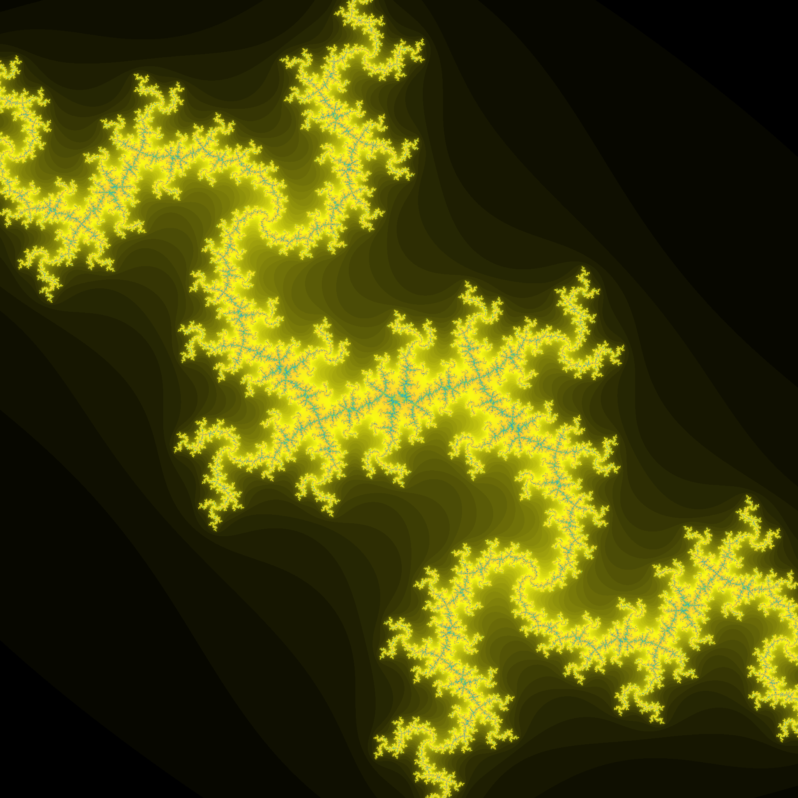

# GPU Fractals
This repository contains some sample code for generating fractals by taking advantage of GPU computing power given by the [OpenGL](https://www.opengl.org/) compute shaders.  
The application in the repository can produce, at the moment, the following fractals:
 - Newton's fractals
 - Mandelbrot's set
 - Julia's set




## Requirements
In order to compile and run the application you need the following external libraries:
 - [GLAD](https://glad.dav1d.de/)
 - [GLFW](https://www.glfw.org/)
 - [STB Image](https://github.com/nothings/stb/blob/master/stb_image.h)
 - [STB Image Write](https://github.com/nothings/stb/blob/master/stb_image_write.h)
 
The libraries must be put inside the `ext` folder in the project. As an alternative, you can change the `CMakeLists.txt` and direct it to the installation dir for the libraries.  

### Additional notes for STB
The header library STB provides the implementation of the functions only when the files are included after the definition of the following macros:
```c
#define STB_IMAGE_IMPLEMENTATION
#define STB_IMAGE_WRITE_IMPLEMENTATION
```
A file with these macros defined is included in the `ext` folder, so don't change it in the `CMakeLists.txt` file.

## Usage
### Compile
The application is build using [CMake](https://cmake.org/). Create a `build` directory inside the repository, configure the CMake project and build.  
During the building process it is possible to enable the random reproducibility or to select the size of the texture. By default, reproducibility is enabled and textures are `4096 X 4096`.
```
    cd build
    cmake .. [-DENABLE_REPRODUCIBILITY=<ON/OFF>] [-DTEX_SIZE=<Value>]
    cmake --build .
```
**WARNING:** At the moment, if `TEX_SIZE` is set manually and you want then to use the default value, you have to either pass it manually, delete the variable from cache or delete the cache.

## Run
The syntax to run the application is the following:
```
    ./GPUFractals <TYPE> [ OPTIONS ]
```
Where `TYPE` can be one in `Newton`, `Mandelbrot` and `Julia` (case-insensitive). The optional arguments depend on the type of fractal.
 - `Mandelbrot` does not have additional options.
 - `Newton` can define the number of roots of the polynomial. If none is given, the application will use by default the roots of `z^3 - 1 = 0`.
 - `Julia` set is computed with the recurrence `z = z^2 + 0.7885 * exp(i * a)`. The optional argument is the value of `a`. If no argument is given, default is `pi / 2`.

Inside the application the following commands can be used:
 - Moving the mouse during a left click will translate the plane along the X and/or Y axis.
 - Moving the mouse during a right click will scale the plane along the X and/or Y axis.
 - Pressing `+`/`-` will increase/decrease the number of iterations (Newton) or the granularity of the colormap (Mandelbrot/Julia).
 - Pressing `E` will export the texture to the current working directory.
 - Pressing `ESC` will close the application.